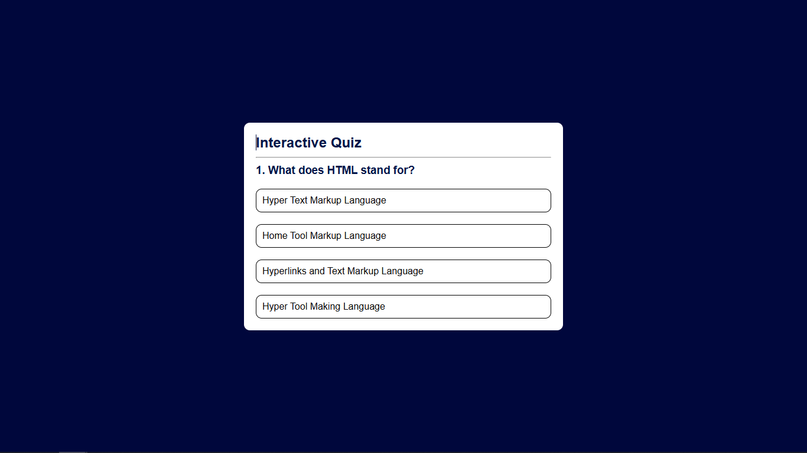
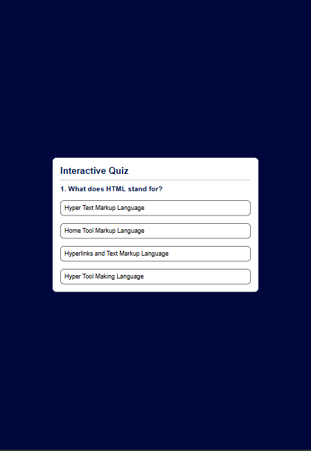
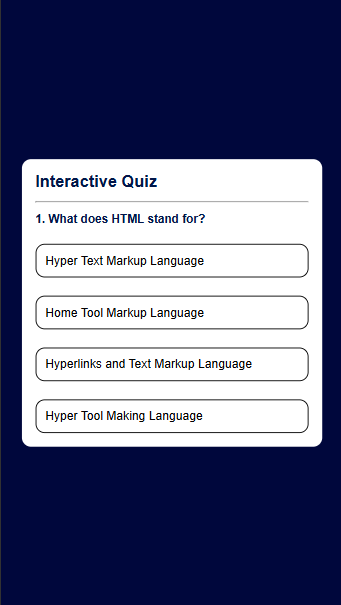

# Quiz App 🎯

A simple and interactive **Quiz Application** built using HTML, CSS, and JavaScript.  
This app lets users test their knowledge through multiple-choice questions, providing instant feedback on correct and wrong answers.

---

## 📸 Preview

| Desktop View | Tablet View | Mobile View |
|----------|----------|----------|
|     |    |    |

---

## 🌎 Live Demo

- [Click to see the Live Demo](https://deeps1970.github.io/Quiz-App/)

---

## 🚀 Features
- Multiple-choice questions with selectable answers
- Score tracking system
- Next question navigation
- Responsive design for mobile and desktop
- Interactive UI with smooth animations

---

## 🛠️ Tech Stack
- **HTML5** – Structure of the app
- **CSS3** – Styling and layout
- **JavaScript** – Core functionality and logic

---

## 📌 How to Use
```bash
1. Clone the repository: git clone https://github.com/<your-username>/quiz-app.git
2. Open index.html in your browser.
3. Start answering questions and track your score!
```

---

## 📜 License
- This project is open-source and available under the MIT License.

---

✨ Made with ❤️ by [Deepak](https://www.linkedin.com/in/deepak1970/)
